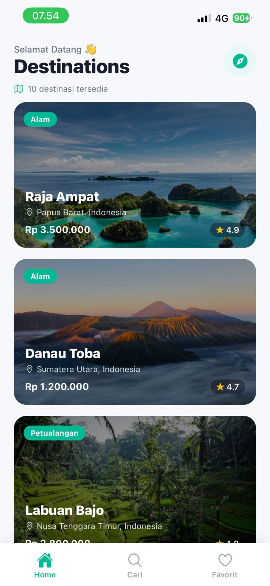
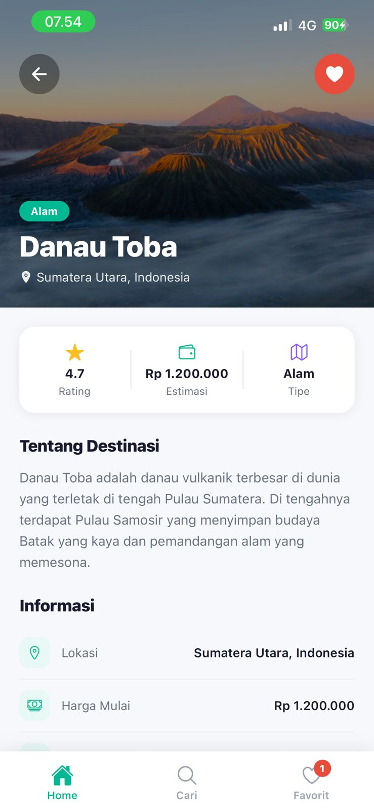
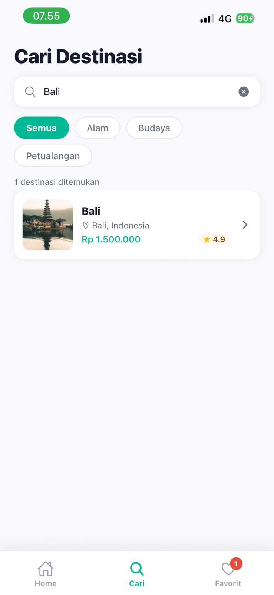
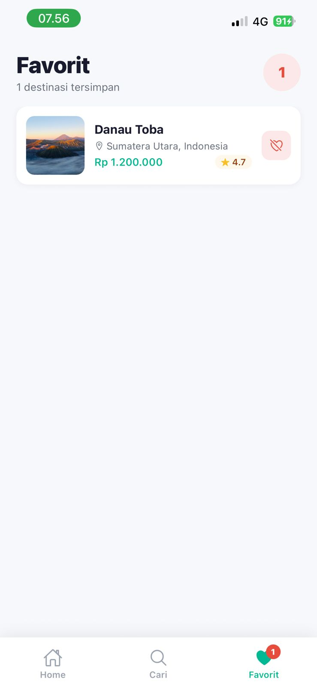

# Travel Buddy 🌏

Multi-screen React Native app dengan React Navigation untuk menjelajahi destinasi wisata Indonesia.

## Screenshots

| HomeScreen | DetailScreen | SearchScreen | FavoritesScreen |
|:---:|:---:|:---:|:---:|
|  |  |  |  |

## Features

- **Bottom Tab Navigation** — Home, Search (Cari), Favorites (Favorit)
- **Stack Navigator di setiap Tab** — nested navigation (Tab → Stack)
- **HomeScreen** — daftar 10 destinasi via FlatList dengan gambar, nama, lokasi, harga, rating
- **DetailScreen** — hero image, info lengkap, tombol Add/Remove Favorit
- **SearchScreen** — filter destinasi by nama/lokasi + filter kategori (Alam, Budaya, Petualangan)
- **FavoritesScreen** — daftar destinasi yang disimpan, bisa dihapus
- **Tab badge** — jumlah favorit ditampilkan di icon tab Favorit
- **Route params** — data destination di-pass via `navigation.navigate('Detail', { destination })`
- **@expo/vector-icons (Ionicons)** — icons di semua tab dan komponen
- **Global state** — Favorites Context (React Context API)

## Bonus Features

- Add to Favorites dari DetailScreen
- Search & filter by nama, lokasi, dan kategori
- Nested Stack Navigator di SearchTab dan FavoritesTab
- Tab badge count untuk favorit

## Tech Stack

- React Native + Expo (SDK 54)
- React Navigation 6 (`@react-navigation/native`, `bottom-tabs`, `native-stack`)
- React Context API (state management)
- StyleSheet (styling)
- @expo/vector-icons / Ionicons

## How to Run

```bash
npm install
npx expo start
```

Scan QR code di aplikasi Expo Go (iOS / Android).


